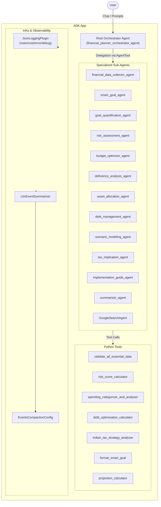
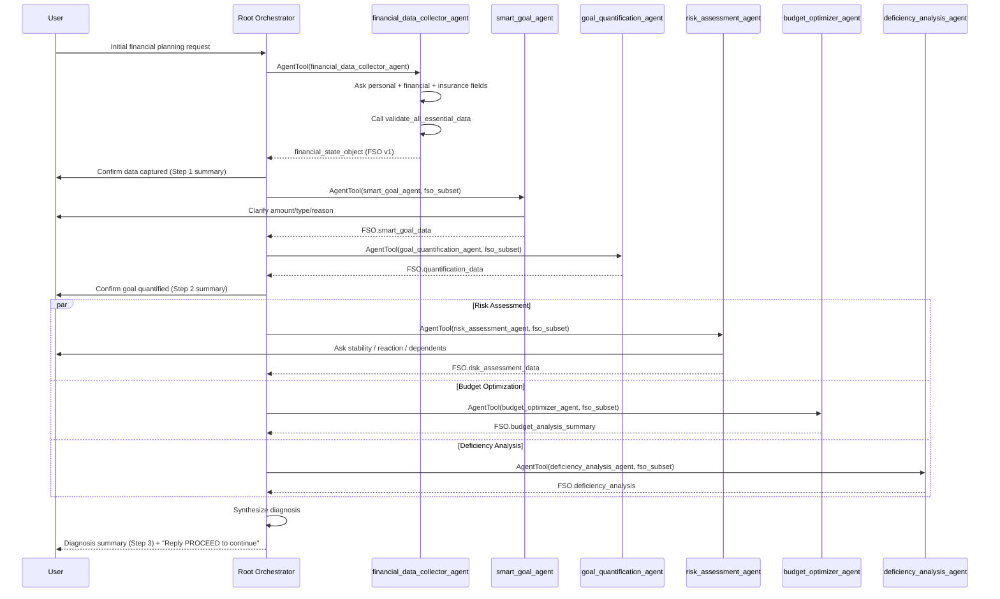
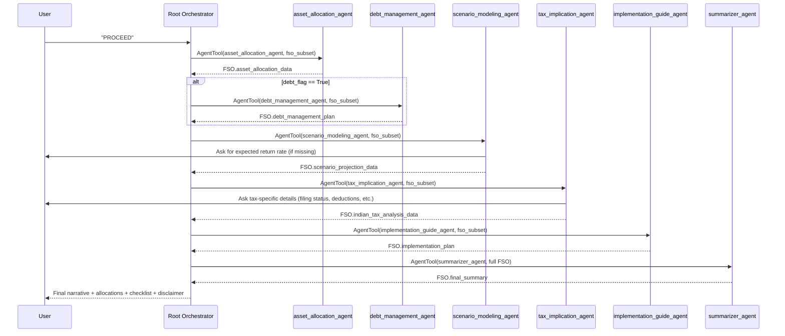

# Financial Planner Orchestrator – End‑to‑End Architecture & Workflow

> **System Name**: Feedback‑Driven Financial Planner Orchestrator (a.k.a. **Viji**)  
> **Core Pattern**: Central **Financial State Object (FSO)** + **LLM Sub‑Agents** + **Event Compaction** + **Production‑grade JSON Logging**

This document explains, in detail:

- The overall architecture and **FSO‑driven orchestration**.
- Each **step of the six‑step workflow** and which agents/tools are involved.
- How **event compaction** and **summarization** work.
- How the **JSON logging plugin** structures production‑grade logs.
- How all of the above interact, with **Mermaid diagrams** (architecture + sequence).

---

## 1. High‑Level Architecture

At the top level you have:

- A **Root Orchestrator Agent**: `financial_planner_orchestrator_agent` (Viji)
- A shared **Financial State Object (FSO)**: a JSON document enriched step‑by‑step.
- A set of **Specialized Sub‑Agents**, each responsible for a slice of the financial planning workflow.
- **Tools** (Python functions) for deterministic calculations.
- An **App container** that wires:
  - Root agent
  - Event compaction / summarization (`LlmEventSummarizer`)
  - JSON logging plugin (`JsonLoggingPlugin`)

### 1.1 Component Overview (Mermaid Diagram)



---

## 2. Financial State Object (FSO) – The Single Source of Truth

The **FSO** is a JSON object that accumulates all data and analysis across the workflow. It typically contains keys such as:

- `user_name`, `user_age`, `user_status` (Working / Retired)
- `base_financial_data` (income, commitments, EMI, investments, savings, emergency fund, insurance flags)
- `smart_goal_data` (SMART‑formatted goals)
- `quantification_data` (future value under inflation)
- `risk_assessment_data` (risk profile, score, liquidity risk)
- `budget_analysis_summary` (cash‑flow, surplus/deficit, optimization suggestions)
- `deficiency_analysis` (EF target, HLV target, debt & insurance gaps)
- `asset_allocation_data` (equity/debt/alternatives %)
- `debt_management_plan` (if debt_flag is True)
- `scenario_projection_data` (projection FV vs goal)
- `indian_tax_analysis_data` (Old vs New regime, strategies)
- `implementation_plan` (action checklist + review cycle)
- `final_summary` (human‑readable narrative)

The **Root Orchestrator** is the only component that owns the **full FSO**.  
Sub‑agents always receive **sliced subsets** of the FSO for token efficiency.

---

## 3. Orchestration Workflow – Six Controlled Steps

The orchestrator follows a strict, CA‑style six‑step planning process:

1. **Data collection (KYC) – FSO v1 creation**
2. **Goal identification & quantification**
3. **Diagnosis (risk, budget, deficiencies)** → **HARD PAUSE**
4. **Plan design (asset allocation, debt, scenario modeling)** – only if user says _PROCEED_.
5. **Implementation (tax, checklist)**
6. **Final narrative summary**

### 3.1 Step 1 – Data Collection & FSO Initialization

**Agent**: `financial_data_collector_agent`  
**Tool**: `validate_all_essential_data`

- Asks for:
  - `user_name`, `user_age`, `user_status` (Working/Retired)
  - Core financials (income/pension, commitments, EMIs, investments, savings, emergency fund)
  - Insurance flags: `has_life_insurance`, `has_health_insurance`
- Passes the financial strings to `validate_all_essential_data` (pure Python) which:
  - Parses numeric formats, JSON, lists, key:value pairs.
  - Validates Yes/No flags for insurance.
- On **success**, the agent builds the first **`financial_state_object`**:
  - Top‑level: `user_name`, `user_age`, `user_status`
  - `base_financial_data`: parsed & validated fields + insurance flags.

> Root Agent stores: `FSO = financial_state_object` and gives a short confirmation to the user.

---

### 3.2 Step 2 – SMART Goal & Quantification

#### 2A. SMART Goal Refinement

**Agent**: `smart_goal_agent`  
**Tool**: `format_smart_goal`

- Input (subset): `{ "fso_subset": { primary_goal, goal_time_horizon } }`
- Interacts to clarify:
  - Goal amount (₹)
  - Goal type: Saving / Investing / Debt payoff
  - Reason / purpose (Specific & Relevant)
- Calls `format_smart_goal()` → returns a JSON string with SMART fields:
  - `S_Specific`, `M_Measurable`, `A_Achievable_Check`, `R_Relevant`, `T_Time_bound_Target_Date`
- Stores result under `FSO.smart_goal_data`.

#### 2B. Goal Quantification (Future Value)

**Agent**: `goal_quantification_agent`  
**Tool**: (LLM‑only math)

- Input (subset): `{ "fso_subset": { "smart_goal_data": FSO.smart_goal_data } }`
- Uses formula: `FV = PV * (1 + 0.06)^n` with default **6% inflation**.
- Writes the future value and explanation to `FSO.quantification_data`.

The root then shows a concise confirmation of the quantified goal.

---

### 3.3 Step 3 – Diagnosis (Risk, Budget, Deficiencies) – HARD PAUSE

Here the root runs **three agents in parallel**, each reading a relevant FSO subset and then updates the FSO.

#### 3A. Risk Assessment

**Agent**: `risk_assessment_agent`  
**Tool**: `risk_score_calculator`

- Extracts from FSO: `user_age`, `user_status`, time horizon, emergency fund coverage, debt vs assets.
- Asks the user for:
  - Income stability (1–5)
  - Reaction to drawdown (A/B/C)
  - Dependents (Yes/No)
- Calls `risk_score_calculator` → returns:
  - `raw_risk_score`
  - `risk_profile` (Aggressive / Moderate / Conservative)
  - `investment_time_horizon`, `insurance_gaps`, `liquidity_risk`
- Writes to `FSO.risk_assessment_data`.

#### 3B. Budget Optimization

**Agent**: `budget_optimizer_agent`  
**Tool**: `spending_categorizer_and_analyser`

- Extracts from FSO: income, fixed/variable/discretionary expenses, emergency fund, target savings.
- Calls `spending_categorizer_and_analyser`, which:
  - Computes net cash flow (surplus/deficit).
  - Checks 50/30/20 patterns and flags optimization areas.
- Writes to `FSO.budget_analysis_summary`.

#### 3C. Deficiency Analysis

**Agent**: `deficiency_analysis_agent`

- Extracts: `monthly_expenses`, `annual_net_income`, existing life insurance, debt details.
- Computes:
  - **Emergency Fund target**: 6× monthly expenses.
  - **HLV target**: 15× annual net income.
- Sets flags in `FSO.deficiency_analysis`:
  - `debt_flag` (if high‑interest debt)
  - `insurance_gap_flag` (coverage < HLV target)

#### 3D. HARD PAUSE

The root now **synthesizes a diagnosis summary** from the updated FSO:

- Risk score & category
- Surplus/deficit
- Deficiencies (EF, HLV, debt, goal gap)

Then it **stops** and tells the user:

> “Here is your diagnosis. Reply **PROCEED** to continue with the financial plan.”

No further steps are executed unless user says **PROCEED / Continue / Yes**.

---

### 3.4 Step 4 – Plan Design (Only After PROCEED)

#### 4A. Asset Allocation

**Agent**: `asset_allocation_agent` (LLM only)

- Input subset: `user_age`, `risk_score`, `user_status`.
- Logic (inside LLM based on instructions):
  - Base equity % = `100 – age`.
  - Adjust ±5–10% based on risk profile (Aggressive higher equity, Conservative lower).
  - For `Retired`, tilt towards capital preservation.
  - Debt = 100 – Equity – Alternatives.
  - Alternatives (e.g., gold) ~5–10% carved out of debt.
- Writes structured result to `FSO.asset_allocation_data`.

#### 4B. Debt Management (Conditional)

**Agent**: `debt_management_agent`  
**Tool**: `debt_optimization_calculator`  
**Runs only if** `FSO.deficiency_analysis.debt_flag == True`.

- Extracts non‑mortgage debts and surplus from budget.
- If needed, asks user for extra commitment.
- Calls `debt_optimization_calculator`, which:
  - Compares **Avalanche** vs **Snowball**.
  - Returns focus debt, estimated payoff time, and strategy.
- Stores plan under `FSO.debt_management_plan`.

#### 4C. Scenario Modeling

**Agent**: `scenario_modeling_agent`  
**Tool**: `projection_calculator`

- Input subset: `smart_goal_data`, `quantification_data`, saved rate (if any).
- If rate missing → asks user: “What expected annual return (%)? Use 7.0 if unsure.”
- Calls `projection_calculator` (pure Python FV math):
  - Combines current savings, contributions, years, and rate.
  - Optionally compares to a 4%‑rule portfolio target.
- Writes result to `FSO.scenario_projection_data`.

---

### 3.5 Step 5 – Implementation (Tax & Checklist)

#### 5A. Tax Implication

**Agent**: `tax_implication_agent`  
**Tool**: `indian_tax_strategy_analyzer`

- Extracts: annual taxable income, home loan status, budget surplus / deductions.
- Asks user only for tax‑specific inputs:
  - Filing status
  - Total expected deductions
  - 80C maxed? (Yes/No)
  - Capital gains exposure? (Yes/No)
- Calls `indian_tax_strategy_analyzer`:
  - Heuristically compares when Old vs New regime may be better.
  - Lists NPS, 80C, 80D, capital‑gains strategies, home‑loan interest.
- Writes to `FSO.indian_tax_analysis_data` and repeats CA disclaimer.

#### 5B. Implementation Guide

**Agent**: `implementation_guide_agent`

- Extracts: `debt_management_plan`, `asset_allocation_data`, `indian_tax_analysis_data`, `deficiency_analysis.insurance_gap_flag`.
- Produces:
  - 5–7 clear action points (start SIPs, close specific debts, optimize 80C, buy insurance, etc.).
  - Review schedule: every 6 months or after major life events.
- Writes to `FSO.implementation_plan`.

---

### 3.6 Step 6 – Final Summary

#### 6A. Summarizer

**Agent**: `summarizer_agent`

- Receives the **full FSO** (this is the only agent allowed to see full FSO as per token rules).
- Produces a **warm, human** narrative:
  - Personal greeting by name
  - Goal restatement and projections
  - Risk profile, cash‑flow position, allocations, debt, tax, checklist
  - 3–5 opportunity areas framed gently

Writes to `FSO.final_summary`.

#### 6B. Final Output

Root agent sends to user:

- Executive summary (using FSO.final_summary)
- Allocation and key steps
- Educational disclaimer: “This plan is for educational purposes only and not registered financial advice.”

---

## 4. Event Compaction & Summarization

### 4.1 App Wiring

```python
from google.adk.apps.app import App, EventsCompactionConfig
from google.adk.apps.llm_event_summarizer import LlmEventSummarizer
from google.adk.models import Gemini
from .agent import root_agent

summarization_llm = Gemini(model="gemini-2.5-flash")
my_summarizer = LlmEventSummarizer(llm=summarization_llm)

app = App(
    name="my-agent",
    root_agent=root_agent,
    events_compaction_config=EventsCompactionConfig(
        summarizer=my_summarizer,
        compaction_interval=3,
        overlap_size=1,
    ),
)
```

- **`compaction_interval=3`**: After every 3 events, older events are **summarized** into a compact `EventCompaction` structure.
- **`overlap_size=1`**: Keeps 1 event as overlap to preserve continuity when summarizing.
- Compaction metadata is logged via `JsonLoggingPlugin` using the `event.actions.compaction` fields.

This keeps the **event history token‑efficient**, while still retaining the gist of previous context.

---

## 5. Production‑Grade Logging – `JsonLoggingPlugin`

### 5.1 Log File Layout

For each agent (via slug) and per session/invocation:

```text
logs/
  <agent_slug>/
    sessions/
      <session_id>/
        main.log    # lifecycle + previews + aggregated metrics
        cost.log    # turn‑level token usage + cost + summaries
        error.log   # model/tool errors
        debug.log   # full payloads (raw user msg, tool args/result, etc.)
    invocations/
      <invocation_id>/
        main.log
        cost.log
        error.log
        debug.log
```

### 5.2 Key Features

- **Token & cost accounting** per event via `on_event_callback` and `MODEL_PRICING` map.
- **Per‑session aggregates** in memory with idle‑based `session_summary` emission after 2 minutes of inactivity.
- **Latency metrics**:
  - `agent_latency_ms`
  - `model_latency_ms` (per call; avg/max aggregated)
  - `tool_latency_ms` (per call; avg/max aggregated)
- **Activity context**:
  - Last user message, last model name, last tool and a preview of its result.
  - Event actions (`transfer_to_agent`, `escalate`, `end_of_agent`, compaction metadata).
- **Separation of concerns**:
  - `main.log`: concise, human‑readable previews for quick debugging.
  - `debug.log`: full raw payloads (configurable redaction) for deep dives or offline analysis.
  - `cost.log`: specialized, queryable cost+usage records.

### 5.3 Example: Turn‑Level Cost Log Structure

Each `turn_cost` entry includes:

```jsonc
{
  "event": "turn_token_usage",
  "usage_scope": "turn",
  "activity": {
    "event_name": "...",
    "agent_name": "...",
    "session_id": "...",
    "invocation_id": "...",
    "last_tool_name": "...",
    "last_tool_result_preview": "...",
    "last_user_message": "...",
    "last_model_name": "gemini-2.5-flash",
    "actions": { "end_of_agent": true, ... }
  },
  "prompt_tokens_turn": 123,
  "candidate_tokens_turn": 456,
  "total_tokens_turn": 579,
  "cost_input_tokens": 123,
  "cost_output_tokens": 456,
  "cost_input": 0.00000923,
  "cost_output": 0.00013680,
  "cost_total": 0.00014603,
  "cost_currency": "USD"
}
```

---

## 6. Sequence Diagrams

### 6.1 High‑Level Orchestration Sequence (Steps 1–3)



### 6.2 Plan Design & Final Summary (Steps 4–6, after PROCEED)



---

## 7. Extensibility & Customization Notes

- **Add new agents** (e.g., Education Planning) by:
  - Creating a new `*_agent.py` + optional `tools.py` functions.
  - Wiring it into `financial_planner_agent.py` via `AgentTool`.
  - Extending the FSO with new keys and updating the orchestrator instructions.
- **Logging** can be tuned by:
  - `redact_sensitive=True` for debug logs.
  - `enable_debug_logs=False` to skip raw payload logging in sensitive environments.
- **Pricing** can be updated by modifying `MODEL_PRICING` in `json_logging_plugin`.

---

## 8. Mental Model Summary

- Think of **FSO** as the **shared medical file**, updated by each specialist.
- The **Root Orchestrator** is the **primary consultant** who:
  - Triages, orders tests (agents/tools), and synthesizes a final plan.
- **Sub‑agents** are **consulting specialists** (risk, tax, debt, allocation).
- **Event Compaction + Logging** give you:
  - Token‑efficient history for the LLMs.
  - Clean, queryable logs for observability, cost tracking, and debugging.

Once this pipeline is wired, you get a **repeatable, explainable, and auditable** financial planning workflow that still feels **personal, empathetic, and interactive** for the end‑user.
